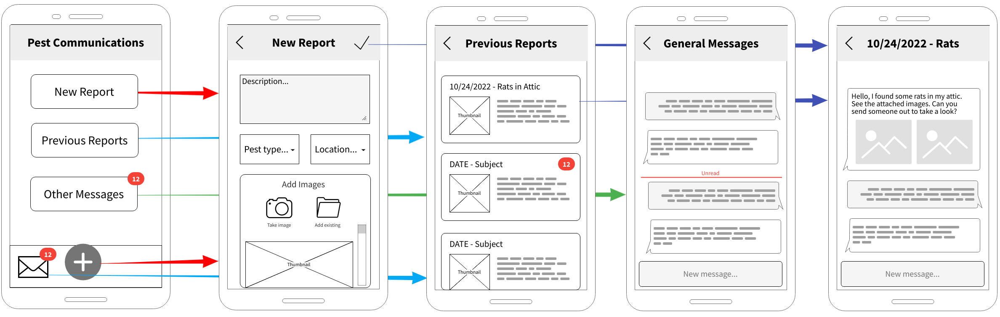

\pagebreak

# Introduction

The Pest Tracking System is a mobile- and web-based application that will ease the coordination between landlords and tenants when the need for pest control arises. Using a preference of either mobile push notifications, automated emails, or both, landlords and tenants can keep in contact about any pests located on the rented property and coordinate the delivery, installation, observation, and disposal of any pest traps required. The application will have an automated reminder system to remind users to keep track of when traps need to be checked or when they need to be replaced. In the case of an emergency, perhaps when a pest situation must be dealt with immediately, the tenant will be able to access a provided list of emergency pest control contacts which will be provided and maintained by the landlord.

Based on interviews and observations of the tenants and landlords, our group have a better understanding about the relationship between the tenants and the landlords. From this understanding, we created three initial design concepts with different focuses on the relationship. (Add more)

The app will have at least 6 screens: a login screen, a sign up screen, a home screen with updates, a setting screen with user information, a mailbox screen, a compose message screen. Each screen will

# Concept 1

This concept focuses on streamlining the experience for a tenant to submit a new pest report to their landlord. Based on class feedback, the initial design has been revised with the following changes:

- The original design implied that new users had to take a new picture through the app in order to submit a report. Peer feedback from the first discussion pointed out that using a camera icon for the new report button implied that taking a picture was the only option, and users would not be able to previously-taken photos or a description. One reviewer suggested that the plus from the second design would work better instead of a camera, and that is what is used in this design.

- It was also unclear for another peer reviewer that the camera button on the landing page also went to the new report section. That design clashed with their mental assumption of what the camera icon meant, and did not match up with the actual action of starting a new report. This has also been improved by switching the camera to a plus.

- Another suggestion from the peer review was to include a dropdown for common pests for the new report screen. This would allow a user to select from a list of preexisting pests in the area with clear images, so that the user can still submit a clear report even if they were not able to get a picture of it in time.

The new flow consists of 5 screens, concerning creating a new report, viewing past reports, and other general communication with the landlord. The first screen -- the landing page when you first open the app -- has three buttons for quick actions emphasized in the middle of the page. There are also action along the bottom with recognisable icons.

The `[New Report]` and `(+)` buttons bring the user to the New Report page, with a text entry box for the tenant to add extra information and a message to their landlord, dropdowns to select the pest type and affected location(s), and a modal to add images to the report. The added images can either be taking directly (the camera button) where the application opens an embedded camera, or selected from the user's gallery if they have already taken a picture. The check button at the top submits the new report and sends it to the landlord, bringing the user to the report conversation page (#5).

The `[Previous Reports]` button on the homepage takes the user to the list of previously submitted reports (page #3). This list shows all of the past submitted reports, ordered by date. Each card shows the date, type of pest, thumbnail of the first image, and the text of the initial report. Clicking on any of the cards brings the user to the corresponding report conversation (page #5).

The `[Other Messages]` button on the homepage takes the user to a general conversation thread with their landlord, outside of any pests reports. This is designed for general conversation, not necessarily pest related. This is structured much like a IM platform, with messages and an unread badge and such.

The Report Conversation page is very similar to the `[Other Messages]` page, with an IM-like message thread. These are per-report and are created via the `[New Report]` page.

# Concept 2

Pest Tracker Concept 2 focuses on being used by the landlord to keep track of communication between them and their tenants, tracking requests made by tenants, and keeping track of pest control appointments through the use of a calendar.

The first design choice was to replace the home button with a simple arrow to signify the "back-button". I received feedback stating the home button in the calendar and messages scenes was thought to lead to the read messages. I don't understand why, but I have replaced it with a simple to understand icon.

The second design choice was to add a properties tab on the main page, and a properties page to provide an addition form of categorization for finding tenants by property. This will allow the landlord to views tenants filtered by which property they live in.

The last design choice was to adjust the messages page. Feedback indicated the unread messages box and the messages box were confusing because of their similarities in information being presented. The two boxes will still exist, but the information will be more precise and easier to convey what information is present.

# Concept 3

# Concept Assessment

# Appendix
